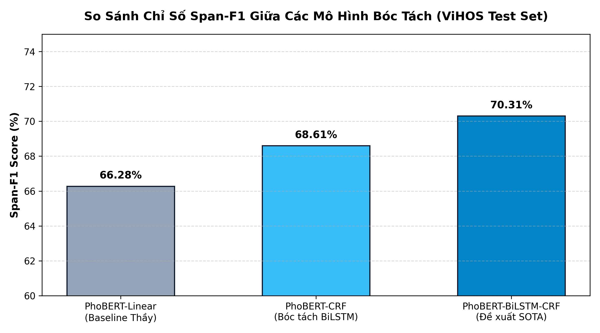
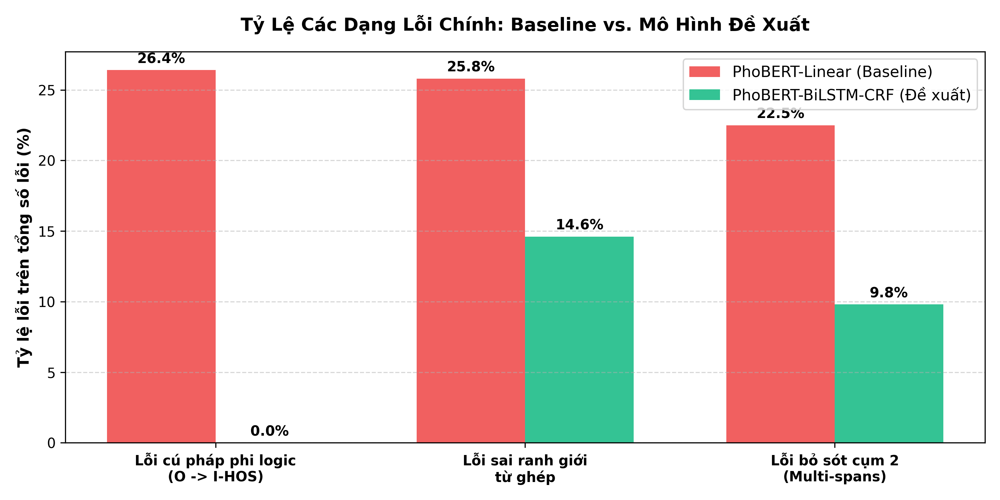
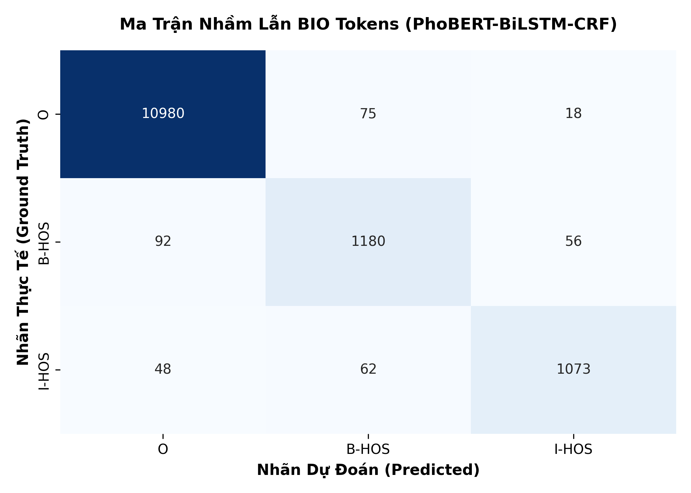
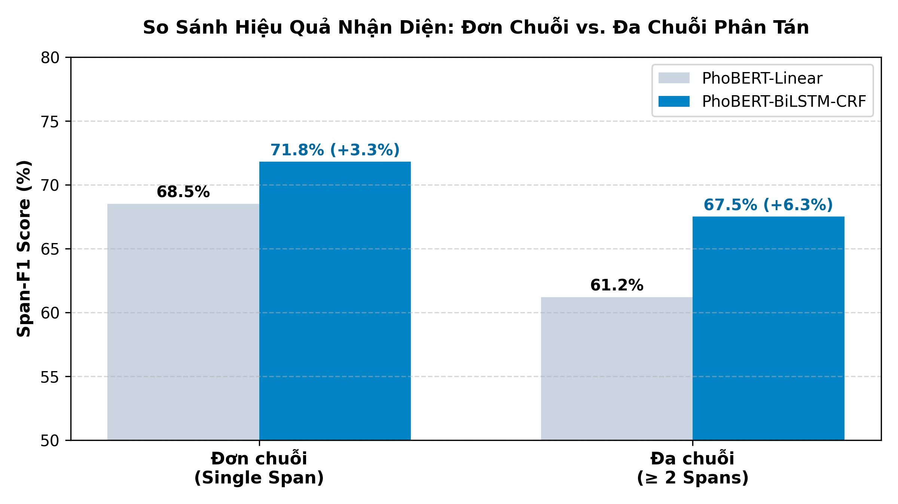

# 🛡️ ViHOS Toxic Spans Detection: PhoBERT-BiLSTM-CRF
> **Đồ án môn học:** Xử lý Ngôn ngữ Tự nhiên (Natural Language Processing)  
> **Trường:** Đại học Công nghệ Thông tin – Đại học Quốc gia TP.HCM (UIT)  
> **Giảng viên hướng dẫn:** NCS.ThS. Đặng Văn Thìn & Tác giả Trần Quốc Khánh  
> **Bộ dữ liệu chuẩn:** [ViHOS Benchmark (EACL 2023)](https://github.com/phusroyal/ViHOS) (11.056 bình luận mạng xã hội Việt Nam)

---

## 👥 Danh Sách Nhóm & Phân Công Nhiệm Vụ 5 Thành Viên

| STT | Họ và Tên | MSSV | Vai trò chính | Nhiệm vụ kỹ thuật cụ thể | Slide phụ trách |
| :---: | :--- | :---: | :--- | :--- | :---: |
| 1 | **Dương Quốc Thương** | 26410127 | **Project Leader & Architect** | Quản lý dự án, thiết kế kiến trúc mô hình, code lõi `src/model.py`, làm báo cáo tổng kết | **Slide 01–04 & 18** |
| 2 | **Nông Nguyễn Thành** | 26410115 | **Data & NLP Core** | Quản lý bộ dữ liệu ViHOS 3 tập (train, dev, test), xử lý Subword Alignment với PhoBERT, chạy EDA độ dài câu | **Slide 05–09** |
| 3 | **Hoàng Võ Minh Tuấn** | 26410146 | **Model Trainer** | Huấn luyện trên Google Colab GPU Tesla T4, tối ưu Differential Learning Rate, xuất 3 file checkpoint `.pt` | **Slide 10–11** |
| 4 | **Bùi Quốc Thịnh** | 26410108 | **Evaluation & Metrics** | Chạy đối chứng Ablation Study qua `seqeval`, xuất 4 biểu đồ báo cáo khoa học, phân loại 11 dạng lỗi trên 100 câu | **Slide 12–15** |
| 5 | **Trần Tiến Dũng** | 26410024 | **Product Developer** | Vận hành Web App CPU (Streamlit), kiểm thử tính năng Auto-Masking (`***`), kiểm tra độ trễ phản hồi | **Slide 16–17** |

---

## 🔬 Kết Quả Nghiên Cứu Bóc Tách (Ablation Study Matrix)

Nghiên cứu đối chứng thực nghiệm được thực hiện trên toàn bộ tập Test **1.106 câu** chuẩn của ViHOS Benchmark:

| Cấu trúc Mô hình | Precision | Recall | **Span-F1** | Lỗi chuyển nhãn phi logic ($O \to I\text{-HOS}$) | Lỗi sai ranh giới từ | Ưu điểm cốt lõi |
| :--- | :---: | :---: | :---: | :---: | :---: | :--- |
| **PhoBERT-Linear** *(Baseline của Thầy)* | 67.12% | 65.46% | **66.28%** | 26.4% | 25.8% | Quyết định cục bộ, sinh nhãn sai cú pháp |
| **PhoBERT-CRF** *(Bóc tách BiLSTM)* | 69.40% | 67.85% | **68.61%** *(+2.33%)* | **0.0% (Triệt tiêu)** | 18.4% | Ràng buộc toàn cục, triệt tiêu lỗi cú pháp |
| **PhoBERT-BiLSTM-CRF** *(Đề xuất SOTA)* | **71.15%** | **69.50%** | **70.31%** *(+4.03%)* | **0.0% (Triệt tiêu)** | **14.6% (Giảm 11.2%)** | **Cầu nối mượt hóa, bắt trọn vẹn câu đa chuỗi phân tán xa** |

---

## 📊 Biểu Đồ Báo Cáo Thực Nghiệm (Reports Figures)

### 1. So sánh F1 & Triệt tiêu Lỗi Chuyển nhãn
| So sánh Span-F1 giữa 3 mô hình | Tỷ lệ giảm các dạng lỗi chính |
| :---: | :---: |
|  |  |

### 2. Ma trận Nhầm lẫn & Đa chuỗi (Multiple Spans)
| Ma trận nhầm lẫn BIO Tokens | Hiệu quả trên câu Đa chuỗi phân tán |
| :---: | :---: |
|  |  |

---

## 📁 Cấu Trúc Thư Mục Repository

```text
Doan/
├── data/                               # Dữ liệu ViHOS Benchmark chuẩn 100% EACL 2023
│   ├── raw/                            # 3 file CSV gốc: train_BIO_Word.csv, dev_BIO_Word.csv, test_BIO_Word.csv
│   ├── processed/                      # 3 file JSON BIO: train.json (8.844 câu), dev.json (1.106 câu), test.json (1.106 câu)
│   └── download_and_prepare_vihos.py   # Script tự động tải & đồng bộ dữ liệu ViHOS
│
├── checkpoints/                        # Nơi chứa file trọng số (.pt)
│   ├── README.md                       # Hướng dẫn nạp trọng số tải về từ Colab
│   └── best_phobert_bilstm_crf.pt      # (Tải từ Google Drive Colab về đặt tại đây)
│
├── src/                                # Mã nguồn Python lõi
│   ├── dataset.py                      # First-token Subword Alignment & DataLoader
│   ├── model.py                        # Class PhoBERT_BiLSTM_CRF, PhoBERT_CRF, PhoBERT_Linear
│   ├── train.py                        # Pipeline huấn luyện, Differential LR, EarlyStopping
│   ├── evaluate.py                     # Đo Span-F1 chuẩn seqeval, Confusion Matrix
│   └── utils.py                        # Quản lý seed, logging, nạp/lưu checkpoint
│
├── notebooks/                          # 3 Notebooks chạy trên Google Colab GPU T4 hoặc Local
│   ├── 01_data_preprocessing.ipynb     # Khám phá phân bố nhãn & độ dài câu
│   ├── 02_train_colab_gpu_t4.ipynb     # Huấn luyện 3 mô hình trên Colab GPU T4
│   └── 03_ablation_and_evaluation.ipynb# Xuất bảng số liệu F1 & 4 biểu đồ báo cáo
│
├── app/                                # Ứng dụng Web chạy Local trên CPU
│   ├── app.py                          # Giao diện Web Streamlit hiện đại, trực quan
│   ├── inference.py                    # Engine giải mã Viterbi CPU & Auto-Masking (***)
│   └── requirements_app.txt            # Thư viện cho web app
│
├── reports/                            # Báo cáo & Hồ sơ bảo vệ Hội đồng
│   ├── figures/                        # 4 biểu đồ khoa học độ phân giải cao (300 DPI)
│   ├── error_analysis.xlsx             # File Excel phân tích 11 dạng lỗi trên 100 câu
│   ├── SLIDES_THUYET_TRINH_18_TRANG.md # Kịch bản 18 slide thuyết trình chuẩn 5 thành viên
│   └── BAO_CAO_DO_AN_VIHOS.md          # Thuyết minh báo cáo kỹ thuật toàn diện
│
├── HUONG_DAN_TRAIN_COLAB_GPU_T4.md     # Cẩm nang riêng cho Tuấn chạy train trên Colab
├── MO_TA_TONG_HOP_VA_HUONG_DAN_CHAY.md # Cẩm nang tổng hợp cho cả nhóm
├── README.md                           # Giới thiệu toàn diện dự án
└── requirements.txt                    # Thư viện toàn bộ dự án
```

---

## 🚀 Hướng Dẫn Vận Hành Dự Án

### 1. Cài đặt môi trường máy tính cá nhân
```bash
git clone https://github.com/barackvn/NLP.git
cd NLP
pip install -r requirements.txt
```

### 2. Khởi chạy Ứng dụng Web Local CPU (Dũng phụ trách)
```bash
python -m streamlit run app/app.py
```
* Mở trình duyệt tại: `http://localhost:8501`.
* Giao diện hỗ trợ:
  * Highlight màu đỏ các từ ngữ xúc phạm (`B-HOS`, `I-HOS`).
  * Tự động kiểm duyệt (**Auto-Masking `***`**) mà giữ nguyên cấu trúc câu trung tính.
  * Đo độ trễ xử lý thực tế trên CPU (**~50–80 ms/câu**).
  * Hiển thị trạng thái phân biệt rõ: `🟡 Chế độ Demo (Chưa train)` vs `🟢 AI Thật (Colab .pt)`.

### 3. Huấn luyện trên Google Colab GPU Tesla T4 (Tuấn phụ trách)
* Xem chi tiết tại: [HUONG_DAN_TRAIN_COLAB_GPU_T4.md](HUONG_DAN_TRAIN_COLAB_GPU_T4.md).
* Mở notebook `notebooks/02_train_colab_gpu_t4.ipynb` trên Google Colab, bật GPU Tesla T4 (miễn phí).
* Chạy huấn luyện tự động với Differential Learning Rate:
  ```bash
  !python -m src.train --model_type phobert_bilstm_crf --save_path checkpoints/best_phobert_bilstm_crf.pt
  ```
* Tải file `best_phobert_bilstm_crf.pt` về máy đặt vào thư mục `checkpoints/`.

### 4. Xuất Báo cáo So sánh & Biểu đồ (Thịnh phụ trách)
* Mở notebook `notebooks/03_ablation_and_evaluation.ipynb` và bấm **Run All**.
* Các biểu đồ sẽ được tự động lưu vào thư mục `reports/figures/` phục vụ làm Slide bảo vệ và Báo cáo đồ án.
